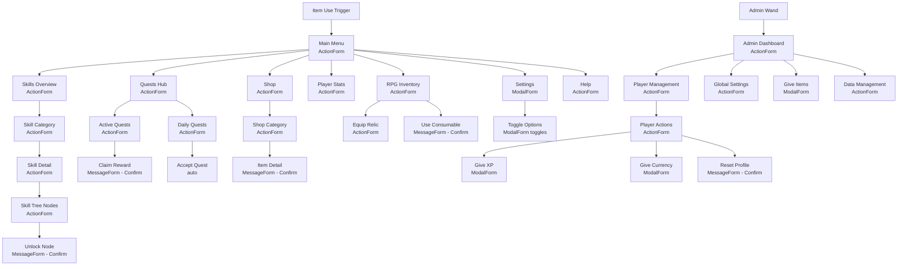

# RPG Skill Add-on — Architecture Plan & Data Schemas

> **Version:** 2.0 (Upgrade)
> **Target API:** `@minecraft/server` 1.10.0+ · `@minecraft/server-ui` 1.2.0+
> **Date:** 2026-02-13

---

## Table of Contents

1. [Current State Analysis](#1-current-state-analysis)
2. [Architecture Diagram](#2-architecture-diagram)
3. [Proposed Data Schemas](#3-proposed-data-schemas)
4. [Skill Catalog — 25+ Skills across 5 Categories](#4-skill-catalog)
5. [Item Catalog — 15+ Items](#5-item-catalog)
6. [Migration Notes](#6-migration-notes)
7. [UI Flow Map](#7-ui-flow-map)
8. [Proposed Folder Structure](#8-proposed-folder-structure)

---

## 1. Current State Analysis

### 1.1 Existing Folder Structure

```
behavior_packs/rpg_skills_bp/
├── manifest.json                    # BP manifest, script entry: scripts/main.js
├── items/
│   ├── admin_wand.json              # rpgskills:admin_wand — opens admin UI
│   ├── coin_pouch.json              # rpgskills:coin_pouch — stackable 64
│   ├── crafting_guide.json          # rpgskills:crafting_guide
│   ├── menu_compass.json            # rpgskills:menu_compass — opens main menu
│   ├── quest_journal.json           # rpgskills:quest_journal — opens quests UI
│   └── skill_tome.json              # rpgskills:skill_tome — opens menu / casts ability
├── recipes/
│   ├── coin_pouch.json              # 8 leather + 1 string
│   ├── crafting_guide.json          # 4 crafting_table + 1 book
│   ├── menu_compass.json            # 4 iron + 1 compass
│   ├── quest_journal.json           # 4 paper + 1 book
│   └── skill_tome.json              # 4 leather + 4 gold + 1 book
└── scripts/
    ├── main.js                      # Entry — registers events, mana regen loop, block tracker save
    ├── config.js                    # CONFIG constants, SKILLS enum, XP formula, SHOP_ITEMS, QUEST_TEMPLATES
    ├── database.js                  # Database class — getDynamicProperty/setDynamicProperty per player
    ├── events.js                    # All event subscriptions — block break/place, combat, fishing, item use, spawn, leave
    ├── systems/
    │   ├── block_tracker.js         # Anti-exploit: tracks player-placed blocks via world dynamic properties
    │   ├── economy.js               # addCoins / removeCoins
    │   ├── stats.js                 # Derived stats recalculation from skill levels
    │   ├── xp.js                    # XP gain, level-up, anti-exploit cooldown
    │   ├── quests/
    │   │   └── questEngine.js       # Daily quest rotation, quest progress tracking
    │   └── skills/
    │       ├── agility.js           # Stub — fall damage reduction
    │       ├── combat.js            # Crit chance, lifesteal perks
    │       ├── farming.js           # Growth aura perk
    │       ├── mining.js            # Extra drops, vein-sense perk
    │       └── woodcutting.js       # Tree-feller perk with BFS
    └── ui/
        ├── admin_ui.js              # Admin dashboard — player management, global settings
        ├── components.js            # UIComponents — progressBar, paginate
        ├── menu.js                  # Main menu, skills list, skill details, stats, help
        ├── quests_ui.js             # Active/daily quests, claim rewards
        ├── router.js                # Navigation back-stack per player
        ├── settings_ui.js           # Toggle particles/sounds/notifications
        └── shop_ui.js               # Category-based shop with purchase confirmation

resource_packs/rpg_skills_rp/
├── manifest.json
├── texts/
│   └── en_US.lang                   # Item names, skill names, UI strings, notifications
└── textures/
    └── item_texture.json            # Texture mappings using vanilla textures as placeholders
```

### 1.2 Current Data Format (v2)

Player data is stored as a **single JSON string** in `player.getDynamicProperty("rpg_player_data")`:

```json
{
  "version": 2,
  "globalLevel": 1,
  "globalXp": 0,
  "mana": 100,
  "maxMana": 100,
  "coins": 0,
  "gems": 0,
  "skills": {
    "mining": { "level": 1, "xp": 0 },
    "woodcutting": { "level": 1, "xp": 0 },
    "farming": { "level": 1, "xp": 0 },
    "combat": { "level": 1, "xp": 0 },
    "archery": { "level": 1, "xp": 0 },
    "fishing": { "level": 1, "xp": 0 },
    "alchemy": { "level": 1, "xp": 0 },
    "agility": { "level": 1, "xp": 0 },
    "defense": { "level": 1, "xp": 0 }
  },
  "perks": {},
  "quests": {
    "active": [],
    "completed": [],
    "daily": [],
    "lastUpdated": 0
  },
  "stats": {
    "bonusDamage": 0,
    "bonusDefense": 0,
    "critChance": 5,
    "lifesteal": 0,
    "miningFortune": 0
  },
  "lastSelectedAbility": null,
  "settings": {
    "particles": true,
    "notifications": true,
    "sounds": true,
    "xpPopups": true
  }
}
```

Block tracker data is stored in `world.getDynamicProperty("rpg_placed_0")`, `rpg_placed_1`, etc. as semicolon-delimited coordinate strings.

### 1.3 Key Observations & Gaps

| Area | Current State | Gap |
|------|--------------|-----|
| **Skills** | 9 skills, flat level 1-100, hardcoded perks at fixed thresholds | No skill tree/nodes, no unlock requirements, no categories, no active abilities with cooldowns |
| **Items** | 6 custom items (UI openers + coin pouch) | No skill shards, XP boosters, relics, respec tokens, RPG tokens |
| **Persistence** | Single JSON blob per player via `getDynamicProperty` | No versioned migration framework, no data integrity checks, approaching 32KB limit risk |
| **UI** | ActionForm + MessageForm, basic router | No ModalForm for skill trees, no pagination for large lists, no confirmation dialogs for destructive actions |
| **Economy** | Coins only, gems field exists but unused | No multi-currency system, no shard/token economy |
| **Perks** | Hardcoded in skill handler files at fixed levels | No data-driven perk/node definitions, no unlock tracking |
| **Anti-exploit** | Block tracker + XP cooldown | No transaction locking, no inventory verification for shop |
| **Localization** | Single `en_US.lang` with ~40 keys | Needs expansion for all new skills, items, UI strings |
| **Config** | Flat object in `config.js` | No separation of skill definitions from runtime config |

---

## 2. Architecture Diagram

```mermaid
graph TB
    subgraph Entry
        MAIN[main.js<br/>Bootstrap & Loops]
    end

    subgraph Core
        CONFIG[ConfigManager<br/>Runtime settings + data-driven defs]
        DB[PlayerDataManager<br/>Load / Save / Migrate]
        MIGRATE[MigrationEngine<br/>v2 -> v3 auto-upgrade]
    end

    subgraph SkillEngine
        SKILL_REG[SkillRegistry<br/>Load skill definitions]
        SKILL_PROC[SkillProcessor<br/>XP gain + level-up logic]
        NODE_MGR[NodeManager<br/>Skill tree unlock/check]
        COOLDOWN[CooldownManager<br/>Active ability cooldowns]
        PERK_ENGINE[PerkEngine<br/>Apply passive/active effects]
    end

    subgraph Systems
        XP[XpSystem<br/>XP calculation + anti-exploit]
        ECON[EconomySystem<br/>Coins + Shards + Tokens]
        STATS[StatsSystem<br/>Derived stat calculation]
        QUEST[QuestEngine<br/>Daily rotation + progress]
        BLOCK[BlockTracker<br/>Anti-exploit placed blocks]
        ITEM_SYS[ItemSystem<br/>Use handlers for RPG items]
    end

    subgraph UI
        ROUTER[Router<br/>Navigation stack]
        COMP[UIComponents<br/>Progress bars + pagination]
        MENU_MAIN[MainMenu]
        MENU_SKILL[SkillTreeUI]
        MENU_SHOP[ShopUI]
        MENU_QUEST[QuestsUI]
        MENU_SETTINGS[SettingsUI]
        MENU_ADMIN[AdminUI]
        MENU_INVENTORY[InventoryUI<br/>RPG item management]
    end

    subgraph Events
        EVT[EventRouter<br/>Block/Combat/Fish/Item dispatching]
    end

    subgraph Data
        SKILL_DEFS[skills/*.json<br/>Skill definitions]
        ITEM_DEFS[items/*.json<br/>Item definitions]
        LANG[texts/en_US.lang<br/>Localization]
    end

    MAIN --> EVT
    MAIN --> CONFIG
    MAIN --> DB

    EVT --> XP
    EVT --> QUEST
    EVT --> BLOCK
    EVT --> ITEM_SYS
    EVT --> PERK_ENGINE

    XP --> SKILL_PROC
    SKILL_PROC --> NODE_MGR
    SKILL_PROC --> COOLDOWN
    SKILL_PROC --> STATS

    DB --> MIGRATE
    CONFIG --> SKILL_REG
    SKILL_REG --> SKILL_DEFS

    MENU_MAIN --> MENU_SKILL
    MENU_MAIN --> MENU_SHOP
    MENU_MAIN --> MENU_QUEST
    MENU_MAIN --> MENU_SETTINGS
    MENU_MAIN --> MENU_INVENTORY
    MENU_ADMIN --> DB

    ITEM_SYS --> ECON
    MENU_SHOP --> ECON

    UI --> ROUTER
    UI --> COMP
```



### Module Responsibilities

| Module | Responsibility |
|--------|---------------|
| **ConfigManager** | Loads runtime config + skill/item definitions from data files |
| **PlayerDataManager** | CRUD for player data via `getDynamicProperty`, handles serialization |
| **MigrationEngine** | Detects data version, runs sequential migrations v2→v3 |
| **SkillRegistry** | Holds all skill definitions in memory, provides lookup by id/category |
| **SkillProcessor** | Handles XP gain, level-up checks, triggers perk unlocks |
| **NodeManager** | Manages skill tree nodes — unlock checks, prerequisite validation |
| **CooldownManager** | Tracks active ability cooldowns per player per skill |
| **PerkEngine** | Applies passive effects on tick, executes active abilities on demand |
| **EconomySystem** | Multi-currency: coins, skill shards, RPG tokens, gems |
| **StatsSystem** | Recalculates derived stats from skill levels + equipped relics |
| **ItemSystem** | Handles `itemUse` for all RPG items — tomes, boosters, shards, relics |
| **EventRouter** | Central dispatcher — routes game events to appropriate systems |
| **Router** | UI navigation back-stack with anti-spam protection |
| **UIComponents** | Reusable form builders — progress bars, pagination, confirmation dialogs |

---

## 3. Proposed Data Schemas

### 3.1 Player Data Schema (v3)

```jsonc
{
  "version": 3,
  "globalLevel": 1,
  "globalXp": 0,
  "mana": 100,
  "maxMana": 100,

  // Multi-currency
  "currencies": {
    "coins": 0,
    "gems": 0,
    "skill_shards": 0,
    "rpg_tokens": 0
  },

  // Skills — keyed by skill ID
  "skills": {
    "combat_swordsmanship": {
      "level": 1,
      "xp": 0,
      "unlockedNodes": ["sword_basics"],
      "activeAbility": null
    }
    // ... one entry per skill
  },

  // Cooldowns — keyed by ability/skill ID
  "cooldowns": {
    "combat_swordsmanship": 0
    // timestamp of when cooldown expires
  },

  // Quests
  "quests": {
    "active": [],
    "completed": [],
    "daily": [],
    "lastUpdated": 0
  },

  // Derived stats — recalculated, not manually edited
  "stats": {
    "bonusDamage": 0,
    "bonusDefense": 0,
    "critChance": 5,
    "critDamage": 150,
    "lifesteal": 0,
    "miningFortune": 0,
    "farmingFortune": 0,
    "fishingLuck": 0,
    "movementSpeed": 0,
    "manaRegen": 5,
    "cooldownReduction": 0
  },

  // Equipped relics — max 3 slots
  "equippedRelics": [null, null, null],

  // Inventory of RPG-specific consumables
  "rpgInventory": {
    "xp_booster_active": null,
    // { "multiplier": 1.5, "expiresAt": <timestamp> }
  },

  "lastSelectedAbility": null,

  "settings": {
    "particles": true,
    "notifications": true,
    "sounds": true,
    "xpPopups": true,
    "compactUI": false,
    "autoLoot": false
  },

  // Lifetime statistics
  "lifetime": {
    "blocksMinedTotal": 0,
    "mobsKilledTotal": 0,
    "questsCompleted": 0,
    "totalXpEarned": 0,
    "totalCoinsEarned": 0,
    "playTimeTicks": 0
  }
}
```

### 3.2 Skill Definition Schema

Each skill is defined in a data-driven JSON file:

```jsonc
{
  "id": "combat_swordsmanship",
  "name": "rpg.skill.combat_swordsmanship",    // lang key
  "description": "rpg.skill.combat_swordsmanship.desc",
  "category": "combat",                         // combat | mining | farming | magic | utility
  "type": "passive",                            // passive | active
  "icon": "textures/ui/skills/swordsmanship",
  "maxLevel": 50,

  // XP formula override — if omitted, uses global formula
  "xpFormula": {
    "base": 100,
    "exponent": 1.5
  },

  // Per-level scaling — evaluated at runtime
  "perLevelEffects": {
    "bonusDamage": { "base": 0.5, "perLevel": 0.5 },
    "critChance": { "base": 0, "perLevel": 0.2 }
  },

  // Skill tree nodes
  "nodes": [
    {
      "id": "sword_basics",
      "name": "rpg.node.sword_basics",
      "description": "rpg.node.sword_basics.desc",
      "unlockLevel": 1,
      "cost": 0,
      "requires": [],
      "effects": { "bonusDamage": 1 }
    },
    {
      "id": "sharp_edge",
      "name": "rpg.node.sharp_edge",
      "description": "rpg.node.sharp_edge.desc",
      "unlockLevel": 10,
      "cost": 5,
      "requires": ["sword_basics"],
      "effects": { "bonusDamage": 3, "critChance": 2 }
    }
  ],

  // Active ability — only for type: active
  "ability": {
    "id": "whirlwind_slash",
    "name": "rpg.ability.whirlwind_slash",
    "description": "rpg.ability.whirlwind_slash.desc",
    "cooldownTicks": 600,
    "manaCost": 30,
    "unlockLevel": 15,
    "scaling": {
      "damage": { "base": 5, "perLevel": 0.5 },
      "radius": { "base": 3, "perLevel": 0.05 }
    }
  },

  // Unlock requirements — what the player needs before this skill appears
  "unlockRequirements": {
    "globalLevel": 1,
    "skills": {},
    "items": []
  }
}
```

### 3.3 Item Definition Schema

```jsonc
{
  "id": "rpg:skill_shard",
  "name": "rpg.item.skill_shard",
  "description": "rpg.item.skill_shard.desc",
  "rarity": "common",                // common | uncommon | rare | epic | legendary
  "category": "currency",            // currency | consumable | relic | tool
  "stackSize": 64,
  "icon": "rpg_skill_shard",
  "obtainedFrom": ["quest_reward", "mob_drop", "shop"],
  "useEffect": null,                 // null for currencies, object for consumables
  // For consumables:
  // "useEffect": {
  //   "type": "xp_booster",
  //   "multiplier": 1.5,
  //   "durationTicks": 12000
  // }
  "recipe": {
    "type": "shaped",
    "pattern": ["..."],
    "key": {},
    "result": { "count": 1 }
  }
}
```

---

## 4. Skill Catalog

### 4.1 Combat (5 skills)

| # | ID | Name | Description | Max Lvl | Per-Level Scaling Example | Unlock Requirement |
|---|-----|------|-------------|---------|--------------------------|-------------------|
| 1 | `combat_swordsmanship` | Swordsmanship | Melee damage mastery | 50 | +0.5% melee damage/lvl, +0.2% crit/lvl | None |
| 2 | `combat_archery` | Archery | Ranged damage mastery | 50 | +0.4% projectile damage/lvl, +0.1% headshot bonus/lvl | None |
| 3 | `combat_defense` | Iron Wall | Damage reduction and armor | 50 | +0.8% damage reduction/lvl, +0.1 hearts max HP every 10 lvls | None |
| 4 | `combat_berserker` | Berserker Rage | Deal more damage at low HP | 30 | Below 30% HP: +1% bonus damage/lvl | Swordsmanship Lvl 15 |
| 5 | `combat_tactician` | Tactician | Combo attacks and finishers | 30 | +0.3% crit damage/lvl, 3-hit combo at lvl 10 | Swordsmanship Lvl 10, Archery Lvl 10 |

**Scaling example — Swordsmanship at Level 25:**
- Bonus melee damage: 0.5 × 25 = **+12.5%**
- Crit chance: 0.2 × 25 = **+5%**
- Node "Sharp Edge" unlocked at Lvl 10: additional **+3% damage, +2% crit**
- Active ability "Whirlwind Slash" at Lvl 15: 5 + 0.5×25 = **17.5 damage** in 3-block radius

### 4.2 Mining (5 skills)

| # | ID | Name | Description | Max Lvl | Per-Level Scaling Example | Unlock Requirement |
|---|-----|------|-------------|---------|--------------------------|-------------------|
| 6 | `mining_excavation` | Excavation | Core mining efficiency | 50 | +1% mining fortune/lvl, double-drop chance: 0.5%/lvl | None |
| 7 | `mining_prospector` | Prospector | Ore detection and bonus gems | 40 | Ore highlight radius: 3 + 0.1/lvl blocks, gem drop chance: 0.2%/lvl | Excavation Lvl 10 |
| 8 | `mining_smelter` | Smelter's Touch | Auto-smelt ores on break | 30 | Auto-smelt chance: 2%/lvl, bonus ingot chance: 0.5%/lvl | Excavation Lvl 20 |
| 9 | `mining_demolition` | Demolition | AoE mining — break multiple blocks | 30 | AoE radius: 1 block at lvl 1, +1 block every 15 lvls | Excavation Lvl 15 |
| 10 | `mining_geologist` | Geologist | Rare mineral discovery | 25 | Rare drop table access: +0.3%/lvl for diamonds/emeralds from stone | Prospector Lvl 15 |

**Scaling example — Excavation at Level 30:**
- Mining fortune: 1 × 30 = **+30%**
- Double-drop chance: 0.5 × 30 = **+15%**

### 4.3 Farming (5 skills)

| # | ID | Name | Description | Max Lvl | Per-Level Scaling Example | Unlock Requirement |
|---|-----|------|-------------|---------|--------------------------|-------------------|
| 11 | `farming_harvest` | Green Thumb | Core farming yield | 50 | +1% crop yield/lvl, replant chance: 0.5%/lvl | None |
| 12 | `farming_growth_aura` | Growth Aura | Accelerate nearby crop growth | 30 | Radius: 3 + 0.1/lvl, tick speed bonus: 1%/lvl | Green Thumb Lvl 15 |
| 13 | `farming_animal_husbandry` | Animal Husbandry | Better breeding and drops | 30 | +1% animal drop bonus/lvl, breeding cooldown -0.5%/lvl | Green Thumb Lvl 10 |
| 14 | `farming_botanist` | Botanist | Discover rare seeds and plants | 25 | Rare seed drop: 0.2%/lvl, exotic crop unlock every 10 lvls | Green Thumb Lvl 20 |
| 15 | `farming_irrigation` | Irrigation | Passive hydration aura | 20 | Hydration radius: 2 + 0.15/lvl blocks, crop growth +0.5%/lvl in radius | Growth Aura Lvl 10 |

**Scaling example — Green Thumb at Level 40:**
- Crop yield bonus: 1 × 40 = **+40%**
- Auto-replant chance: 0.5 × 40 = **+20%**

### 4.4 Magic (5 skills)

| # | ID | Name | Description | Max Lvl | Per-Level Scaling Example | Unlock Requirement |
|---|-----|------|-------------|---------|--------------------------|-------------------|
| 16 | `magic_arcana` | Arcana | Core mana pool and regen | 50 | +2 max mana/lvl, +0.5 mana regen/lvl | Global Level 5 |
| 17 | `magic_fireball` | Pyromancy | Fireball active ability | 30 | Damage: 4 + 0.8/lvl, AoE radius: 2 + 0.05/lvl, cooldown: 600 - 5/lvl ticks | Arcana Lvl 10 |
| 18 | `magic_healing` | Restoration | Self-heal active ability | 30 | Heal: 2 + 0.5/lvl hearts, cooldown: 400 - 4/lvl ticks, mana cost: 40 - 0.3/lvl | Arcana Lvl 10 |
| 19 | `magic_enchanting` | Enchanting Mastery | Better enchantment results | 25 | +1% enchant level bonus/lvl, rare enchant chance: 0.3%/lvl | Arcana Lvl 15 |
| 20 | `magic_telekinesis` | Telekinesis | Auto-collect drops to inventory | 20 | Collection radius: 3 + 0.2/lvl blocks | Arcana Lvl 20 |

**Scaling example — Pyromancy at Level 20:**
- Fireball damage: 4 + 0.8×20 = **20 damage**
- AoE radius: 2 + 0.05×20 = **3 blocks**
- Cooldown: 600 - 5×20 = **500 ticks (25s)**

### 4.5 Utility (6 skills)

| # | ID | Name | Description | Max Lvl | Per-Level Scaling Example | Unlock Requirement |
|---|-----|------|-------------|---------|--------------------------|-------------------|
| 21 | `utility_agility` | Agility | Movement speed and fall damage | 50 | +0.5% speed/lvl, fall damage -1%/lvl | None |
| 22 | `utility_fishing` | Angler | Fishing luck and speed | 40 | +1% fish quality/lvl, bite speed +0.5%/lvl | None |
| 23 | `utility_woodcutting` | Lumberjack | Tree felling efficiency | 40 | +1% wood yield/lvl, tree-feller max logs: 32 + 1/lvl | None |
| 24 | `utility_alchemy` | Alchemy | Potion brewing enhancements | 30 | +1% potion duration/lvl, +0.5% potion potency/lvl | Global Level 10 |
| 25 | `utility_luck` | Fortune's Favor | Global luck modifier | 25 | +0.2% all drop rates/lvl, +0.1% rare find/lvl | Global Level 15 |
| 26 | `utility_endurance` | Endurance | Hunger and stamina management | 30 | Hunger drain -0.5%/lvl, sprint duration +1%/lvl | Agility Lvl 10 |

**Scaling example — Agility at Level 50:**
- Movement speed: 0.5 × 50 = **+25%**
- Fall damage reduction: 1 × 50 = **-50%** (capped)

---

## 5. Item Catalog

### 5.1 Skill Tomes (Unlock / Respec)

| # | ID | Name | Rarity | Purpose | How Obtained |
|---|-----|------|--------|---------|-------------|
| 1 | `rpg:skill_tome` | Skill Tome | Uncommon | Opens skill menu, cast last ability when sneaking | Crafting: 4 leather + 4 gold + 1 book |
| 2 | `rpg:skill_reset_tome` | Tome of Forgetting | Rare | Resets all nodes in one skill, refunds shards | Boss drop, Admin shop for 500 tokens |
| 3 | `rpg:full_reset_tome` | Tome of Rebirth | Epic | Full profile reset — all skills reset to 1, refunds 80% shards | Admin shop for 2000 tokens |
| 4 | `rpg:skill_unlock_tome` | Tome of Discovery | Rare | Unlocks a locked skill bypassing level requirements | Quest reward, rare mob drop |

### 5.2 Skill Shards (Currency)

| # | ID | Name | Rarity | Purpose | How Obtained |
|---|-----|------|--------|---------|-------------|
| 5 | `rpg:skill_shard` | Skill Shard | Common | Currency to unlock skill tree nodes | XP level-ups: 1-3 per level, quest rewards |
| 6 | `rpg:skill_shard_bundle` | Shard Bundle | Uncommon | Grants 10 skill shards when used | Crafting: 9 skill shards, daily login reward |
| 7 | `rpg:prismatic_shard` | Prismatic Shard | Rare | Worth 5 regular shards, used for advanced nodes | Boss drops, rare mining find |

### 5.3 RPG Tokens (Quest / Daily Rewards)

| # | ID | Name | Rarity | Purpose | How Obtained |
|---|-----|------|--------|---------|-------------|
| 8 | `rpg:rpg_token` | RPG Token | Common | Premium currency for admin shop items | Daily quest completion, achievements |
| 9 | `rpg:token_pouch` | Token Pouch | Uncommon | Grants 5 RPG tokens when used | Weekly quest reward |

### 5.4 XP Boosters

| # | ID | Name | Rarity | Purpose | How Obtained |
|---|-----|------|--------|---------|-------------|
| 10 | `rpg:xp_booster_small` | Minor XP Scroll | Common | 1.25x XP for 10 minutes | Shop: 50 coins, quest reward |
| 11 | `rpg:xp_booster_medium` | Greater XP Scroll | Uncommon | 1.5x XP for 10 minutes | Shop: 200 coins, daily reward |
| 12 | `rpg:xp_booster_large` | Superior XP Scroll | Rare | 2.0x XP for 10 minutes | Boss drop, 100 RPG tokens |

### 5.5 Skill Relics (Unique Passives)

| # | ID | Name | Rarity | Purpose | How Obtained |
|---|-----|------|--------|---------|-------------|
| 13 | `rpg:relic_warriors_crest` | Warrior's Crest | Epic | Equipped relic: +10% melee damage, +5% crit chance | Boss drop: Wither |
| 14 | `rpg:relic_miners_heart` | Miner's Heart | Epic | Equipped relic: +15% mining fortune, auto-smelt 10% | Rare deep mining find below Y=-40 |
| 15 | `rpg:relic_natures_blessing` | Nature's Blessing | Epic | Equipped relic: +20% crop yield, growth aura +2 radius | Farming milestone: harvest 10,000 crops |
| 16 | `rpg:relic_arcane_focus` | Arcane Focus | Legendary | Equipped relic: +25% mana regen, -15% cooldowns | Boss drop: Elder Guardian |
| 17 | `rpg:relic_lucky_charm` | Lucky Charm | Rare | Equipped relic: +5% all drop rates, +10% coin gain | Fishing at Lvl 30+, rare catch |

### 5.6 Utility Items (Existing, Retained)

| # | ID | Name | Rarity | Purpose | How Obtained |
|---|-----|------|--------|---------|-------------|
| 18 | `rpg:menu_compass` | Adventurer's Compass | Common | Opens main RPG menu | Crafting, given on first join |
| 19 | `rpg:quest_journal` | Quest Journal | Common | Opens quest UI | Crafting |
| 20 | `rpg:admin_wand` | Admin Wand | Admin | Opens admin dashboard | Admin-only give command |
| 21 | `rpg:coin_pouch` | Coin Pouch | Common | Grants random 10-50 coins when used | Crafting, mob drops |
| 22 | `rpg:crafting_guide` | Crafting Guide | Common | Shows RPG recipes | Crafting |

> **Note:** Item namespace changes from `rpgskills:` to `rpg:` for brevity. A migration alias will be provided.

---

## 6. Migration Notes

### 6.1 Current Data Format (v2)

As documented in [Section 1.2](#12-current-data-format-v2), player data is stored as:
- **Storage key:** `rpg_player_data` on each player entity
- **Format:** JSON string via `player.getDynamicProperty()`
- **Version field:** `version: 2`
- **Skills:** Flat map of 9 skills with `{ level, xp }` only
- **Economy:** `coins` and `gems` as top-level fields
- **Perks:** Empty object `{}` — never populated
- **Block tracker:** World-level dynamic properties `rpg_placed_0`, `rpg_placed_1`, etc.

### 6.2 Migration Strategy: v2 → v3

The migration runs **automatically on first load** when `data.version < 3`:

```
Step 1: Restructure currencies
  - Move data.coins → data.currencies.coins
  - Move data.gems → data.currencies.gems
  - Add data.currencies.skill_shards = 0
  - Add data.currencies.rpg_tokens = 0
  - Delete data.coins, data.gems

Step 2: Expand skills
  - For each existing skill in data.skills:
    - Add unlockedNodes: [] — auto-unlock base node
    - Add activeAbility: null
  - Map old skill IDs to new IDs:
    - mining → mining_excavation
    - woodcutting → utility_woodcutting
    - farming → farming_harvest
    - combat → combat_swordsmanship
    - archery → combat_archery
    - fishing → utility_fishing
    - alchemy → utility_alchemy
    - agility → utility_agility
    - defense → combat_defense
  - Preserve existing level and xp values

Step 3: Add new fields
  - data.cooldowns = {}
  - data.equippedRelics = [null, null, null]
  - data.rpgInventory = { xp_booster_active: null }
  - data.lifetime = { blocksMinedTotal: 0, ... }
  - Expand data.stats with new fields

Step 4: Grant migration bonus
  - Award skill_shards based on total existing levels
    Formula: sum of all skill levels × 2
  - Send welcome message about the upgrade

Step 5: Set version
  - data.version = 3
  - Save immediately
```

### 6.3 Item Namespace Migration

Old items with `rpgskills:` prefix will be aliased:
- Register `itemUse` handlers for both `rpgskills:*` and `rpg:*` prefixes
- On use of old-prefix item, replace in inventory with new-prefix equivalent
- Recipes updated to produce `rpg:*` items only

### 6.4 Block Tracker Migration

No changes needed — the block tracker format is independent and remains compatible.

### 6.5 Safety Measures

- **Backup before migration:** Log full JSON to console before modifying
- **Atomic save:** Only call `savePlayerData` once after all changes
- **Rollback flag:** If migration fails, keep v2 data and retry next load
- **Version gate:** Each migration step checks version to avoid double-application

---

## 7. UI Flow Map

### 7.1 Menu Tree



### 7.2 Form Types Used

| Form Type | Usage |
|-----------|-------|
| **ActionFormData** | All list/menu screens — main menu, skill lists, quest lists, shop categories, inventory |
| **ModalFormData** | Settings toggles, admin input forms — give XP amount, give coins, dropdown selectors |
| **MessageFormData** | All confirmation dialogs — purchase confirm, node unlock confirm, reset confirm, quest claim |

### 7.3 Safety Rules

| Rule | Implementation |
|------|---------------|
| **Anti-dupe on purchase** | Debounce map: 500ms cooldown per player after any transaction. Re-verify balance before final deduction. |
| **Anti-desync on forms** | Re-fetch `Database.getPlayerData()` after every form `.show()` resolves, before applying changes. Never cache data across async boundaries. |
| **Anti-spam on UI open** | Router tracks last open timestamp; reject opens within 200ms of previous. |
| **Transaction integrity** | All currency operations use `Economy.trySpend()` which does atomic read-check-write. Returns false if insufficient. |
| **Node unlock validation** | `NodeManager.canUnlock()` checks: level requirement met, prerequisite nodes unlocked, shard cost affordable — all in single sync call before deduction. |
| **Admin permission check** | Every admin UI entry point checks `player.hasTag(CONFIG.ADMIN_TAG)` before showing form. |
| **Inventory verification** | Before giving items via shop, check `emptySlotsCount > 0`. If full, show error and refund. |
| **Cooldown enforcement** | Active abilities check `CooldownManager.isReady()` before execution. Cooldown set server-side, not client-trustable. |
| **Data size management** | Monitor serialized JSON size. If approaching 32KB limit, compress by pruning completed quest history older than 7 days. |

---

## 8. Proposed Folder Structure

```
behavior_packs/rpg_skills_bp/
├── manifest.json
├── pack_icon.png
│
├── items/
│   ├── tools/
│   │   ├── menu_compass.json
│   │   ├── skill_tome.json
│   │   ├── quest_journal.json
│   │   ├── admin_wand.json
│   │   └── crafting_guide.json
│   ├── currency/
│   │   ├── coin_pouch.json
│   │   ├── skill_shard.json
│   │   ├── skill_shard_bundle.json
│   │   ├── prismatic_shard.json
│   │   ├── rpg_token.json
│   │   └── token_pouch.json
│   ├── consumables/
│   │   ├── xp_booster_small.json
│   │   ├── xp_booster_medium.json
│   │   ├── xp_booster_large.json
│   │   ├── skill_reset_tome.json
│   │   ├── full_reset_tome.json
│   │   └── skill_unlock_tome.json
│   └── relics/
│       ├── warriors_crest.json
│       ├── miners_heart.json
│       ├── natures_blessing.json
│       ├── arcane_focus.json
│       └── lucky_charm.json
│
├── recipes/
│   ├── tools/
│   │   ├── menu_compass.json
│   │   ├── skill_tome.json
│   │   ├── quest_journal.json
│   │   └── crafting_guide.json
│   ├── currency/
│   │   ├── coin_pouch.json
│   │   └── skill_shard_bundle.json
│   └── consumables/
│       ├── xp_booster_small.json
│       └── xp_booster_medium.json
│
├── scripts/
│   ├── main.js                          # Entry point — bootstrap
│   │
│   ├── core/
│   │   ├── config.js                    # Runtime CONFIG constants
│   │   ├── database.js                  # PlayerDataManager — CRUD
│   │   ├── migration.js                 # MigrationEngine — v2→v3
│   │   └── event_router.js             # Central event dispatcher
│   │
│   ├── data/
│   │   ├── skill_definitions.js         # All 26 skill definitions as JS objects
│   │   ├── item_definitions.js          # All item metadata
│   │   ├── quest_templates.js           # Quest template definitions
│   │   └── shop_catalog.js             # Shop item listings with requirements
│   │
│   ├── engine/
│   │   ├── skill_registry.js            # SkillRegistry — load and lookup skills
│   │   ├── skill_processor.js           # XP gain, level-up, perk triggers
│   │   ├── node_manager.js             # Skill tree node unlock logic
│   │   ├── cooldown_manager.js         # Active ability cooldown tracking
│   │   └── perk_engine.js              # Passive/active effect application
│   │
│   ├── systems/
│   │   ├── xp.js                        # XP calculation with anti-exploit
│   │   ├── economy.js                   # Multi-currency management
│   │   ├── stats.js                     # Derived stat recalculation
│   │   ├── block_tracker.js            # Anti-exploit block tracking
│   │   ├── item_handler.js             # RPG item use dispatcher
│   │   ├── relic_system.js             # Relic equip/unequip/effects
│   │   ├── booster_system.js           # XP booster activation/expiry
│   │   └── quests/
│   │       └── quest_engine.js          # Quest progress, daily rotation, rewards
│   │
│   ├── skills/
│   │   ├── combat/
│   │   │   ├── swordsmanship.js
│   │   │   ├── archery.js
│   │   │   ├── defense.js
│   │   │   ├── berserker.js
│   │   │   └── tactician.js
│   │   ├── mining/
│   │   │   ├── excavation.js
│   │   │   ├── prospector.js
│   │   │   ├── smelter.js
│   │   │   ├── demolition.js
│   │   │   └── geologist.js
│   │   ├── farming/
│   │   │   ├── harvest.js
│   │   │   ├── growth_aura.js
│   │   │   ├── animal_husbandry.js
│   │   │   ├── botanist.js
│   │   │   └── irrigation.js
│   │   ├── magic/
│   │   │   ├── arcana.js
│   │   │   ├── pyromancy.js
│   │   │   ├── restoration.js
│   │   │   ├── enchanting.js
│   │   │   └── telekinesis.js
│   │   └── utility/
│   │       ├── agility.js
│   │       ├── fishing.js
│   │       ├── woodcutting.js
│   │       ├── alchemy.js
│   │       ├── luck.js
│   │       └── endurance.js
│   │
│   └── ui/
│       ├── router.js                    # Navigation stack with anti-spam
│       ├── components.js               # Reusable UI builders
│       ├── menu.js                      # Main menu
│       ├── skills_ui.js                # Skill categories + detail + tree
│       ├── quests_ui.js                # Quest hub
│       ├── shop_ui.js                  # Shop with categories
│       ├── stats_ui.js                 # Player stats display
│       ├── inventory_ui.js             # RPG inventory + relic management
│       ├── settings_ui.js             # Settings toggles
│       ├── admin_ui.js                 # Admin dashboard
│       └── help_ui.js                  # Help and tutorial

resource_packs/rpg_skills_rp/
├── manifest.json
├── pack_icon.png
│
├── texts/
│   └── en_US.lang                       # All localization strings
│
├── textures/
│   ├── item_texture.json               # Texture atlas mappings
│   └── items/
│       ├── rpg_skill_shard.png
│       ├── rpg_prismatic_shard.png
│       ├── rpg_token.png
│       ├── rpg_xp_booster_small.png
│       ├── rpg_xp_booster_medium.png
│       ├── rpg_xp_booster_large.png
│       ├── rpg_skill_reset_tome.png
│       ├── rpg_full_reset_tome.png
│       ├── rpg_skill_unlock_tome.png
│       ├── rpg_warriors_crest.png
│       ├── rpg_miners_heart.png
│       ├── rpg_natures_blessing.png
│       ├── rpg_arcane_focus.png
│       ├── rpg_lucky_charm.png
│       ├── rpg_token_pouch.png
│       └── rpg_shard_bundle.png
│
└── ui/
    └── skills/
        ├── combat_swordsmanship.png
        ├── combat_archery.png
        ├── combat_defense.png
        ├── combat_berserker.png
        ├── combat_tactician.png
        ├── mining_excavation.png
        ├── mining_prospector.png
        ├── mining_smelter.png
        ├── mining_demolition.png
        ├── mining_geologist.png
        ├── farming_harvest.png
        ├── farming_growth_aura.png
        ├── farming_animal_husbandry.png
        ├── farming_botanist.png
        ├── farming_irrigation.png
        ├── magic_arcana.png
        ├── magic_fireball.png
        ├── magic_healing.png
        ├── magic_enchanting.png
        ├── magic_telekinesis.png
        ├── utility_agility.png
        ├── utility_fishing.png
        ├── utility_woodcutting.png
        ├── utility_alchemy.png
        ├── utility_luck.png
        └── utility_endurance.png
```

---

## Appendix: Implementation Priority

1. **Core refactor** — `database.js` → `PlayerDataManager` + `MigrationEngine`
2. **Skill engine** — `SkillRegistry`, `SkillProcessor`, `NodeManager`
3. **Data definitions** — All 26 skill definitions, item definitions
4. **Economy upgrade** — Multi-currency system
5. **New items** — Shards, tokens, boosters, relics (JSON + handlers)
6. **UI overhaul** — Skill tree UI, inventory UI, improved settings
7. **Perk engine** — All passive/active skill effects
8. **Admin tools** — Extended admin UI with data management
9. **Localization** — Full `en_US.lang` expansion
10. **Testing & polish** — Anti-exploit verification, edge cases, performance
