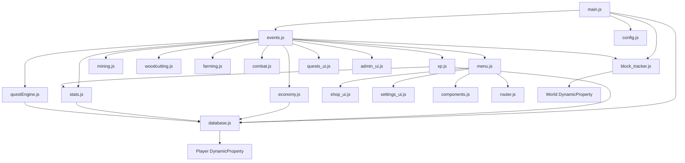
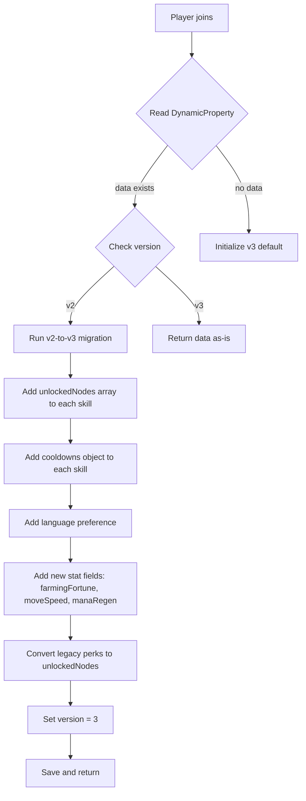

# RPG Skill Add-on — Architecture Plan

> **Version:** 2.0 Proposal  
> **Target Engine:** Minecraft Bedrock 1.20+  
> **APIs:** `@minecraft/server` 1.10.0, `@minecraft/server-ui` 1.2.0  
> **Persistence:** Player & World `DynamicProperty` (JSON-serialized)

---

## A) Text-based Architecture Diagram

```
┌─────────────────────────────────────────────────────────────────────┐
│                          ENTRY POINT                                │
│                         main.js                                     │
│   ┌──────────┐  ┌──────────────┐  ┌──────────────┐                 │
│   │ Mana Loop│  │ BlockTracker │  │ registerEvents│                 │
│   │  Regen   │  │   .save()    │  │   (events.js)│                 │
│   └────┬─────┘  └──────┬───────┘  └──────┬───────┘                 │
│        │               │                 │                          │
└────────┼───────────────┼─────────────────┼──────────────────────────┘
         │               │                 │
         ▼               ▼                 ▼
┌─────────────────────────────────────────────────────────────────────┐
│                        EVENT ROUTER (events.js)                     │
│                                                                     │
│  playerBreakBlock ──► Mining / Woodcutting / Farming handlers       │
│  entityDie ──────────► Combat / Archery XP + Quest progress         │
│  playerFish ─────────► Fishing XP + Quest progress                  │
│  itemUse ────────────► Item Router (Tome/Compass/Journal/Wand)      │
│  playerSpawn ────────► Daily Quest rotation + Stats recalc          │
│  playerLeave ────────► XP cooldown cleanup                          │
│  runInterval ────────► Farming aura tick                            │
└────────┬────────────────────────────────────────────────────────────┘
         │
         ▼
┌─────────────────────────────────────────────────────────────────────┐
│                         CORE SYSTEMS                                │
│                                                                     │
│  ┌──────────────┐  ┌──────────────┐  ┌──────────────┐              │
│  │  XP System   │  │   Economy    │  │ Stats System │              │
│  │  (xp.js)     │  │ (economy.js) │  │  (stats.js)  │              │
│  │              │  │              │  │              │              │
│  │ addXp()      │  │ addCoins()   │  │ recalculate  │              │
│  │ levelUp()    │  │ removeCoins()│  │ Stats()      │              │
│  │ globalLevel  │  │              │  │              │              │
│  └──────┬───────┘  └──────┬───────┘  └──────┬───────┘              │
│         │                 │                 │                       │
│         ▼                 ▼                 ▼                       │
│  ┌──────────────────────────────────────────────────────┐          │
│  │              DATABASE (database.js)                   │          │
│  │                                                       │          │
│  │  getPlayerData() ──► JSON.parse(DynamicProperty)      │          │
│  │  savePlayerData() ─► JSON.stringify ► DynamicProperty │          │
│  │  initializePlayer() ─► default schema v2              │          │
│  │  Migration: v1 ► v2 (adds coins, gems, quests, etc.) │          │
│  └──────────────────────────────────────────────────────┘          │
│                                                                     │
│  ┌──────────────┐  ┌──────────────────────────────────┐            │
│  │ Block Tracker│  │       Quest Engine                │            │
│  │(block_tracker│  │   (questEngine.js)                │            │
│  │   .js)       │  │                                    │            │
│  │              │  │  updateDailyQuests()               │            │
│  │ Anti-exploit │  │  progressQuest()                   │            │
│  │ place/break  │  │  Date-seed rotation                │            │
│  │ tracking     │  │                                    │            │
│  └──────────────┘  └──────────────────────────────────┘            │
└─────────────────────────────────────────────────────────────────────┘
         │
         ▼
┌─────────────────────────────────────────────────────────────────────┐
│                      SKILL HANDLERS                                 │
│                                                                     │
│  ┌──────────┐ ┌────────────┐ ┌──────────┐ ┌──────────┐ ┌────────┐ │
│  │ mining.js│ │woodcutting │ │farming.js│ │combat.js │ │agility │ │
│  │          │ │   .js      │ │          │ │          │ │  .js   │ │
│  │VeinSense │ │TreeFeller  │ │GrowthAura│ │CritHit   │ │FallDmg │ │
│  │ExtraDrops│ │BFS+Stagger │ │BoneMeal  │ │Lifesteal │ │Reduce  │ │
│  └──────────┘ └────────────┘ └──────────┘ └──────────┘ └────────┘ │
└─────────────────────────────────────────────────────────────────────┘
         │
         ▼
┌─────────────────────────────────────────────────────────────────────┐
│                         UI LAYER                                    │
│                                                                     │
│  ┌──────────┐  ┌──────────┐  ┌──────────┐  ┌──────────┐           │
│  │ menu.js  │  │ shop_ui  │  │quests_ui │  │admin_ui  │           │
│  │          │  │  .js     │  │  .js     │  │  .js     │           │
│  │MainMenu  │  │Category  │  │Active    │  │PlayerMgmt│           │
│  │Skills    │  │Purchase  │  │Daily     │  │GiveCoins │           │
│  │Stats     │  │Confirm   │  │Claim     │  │GiveXP    │           │
│  │Help      │  │          │  │          │  │Reset     │           │
│  └──────────┘  └──────────┘  └──────────┘  └──────────┘           │
│                                                                     │
│  ┌──────────┐  ┌──────────┐                                        │
│  │settings  │  │router.js │  ◄── Back-stack navigation             │
│  │ _ui.js   │  │          │                                        │
│  │Toggles   │  │push/back │                                        │
│  └──────────┘  │clearStack│                                        │
│                └──────────┘                                        │
│                                                                     │
│  ┌──────────────────────────────────────────────────────┐          │
│  │           components.js                               │          │
│  │  progressBar()  paginate()                            │          │
│  └──────────────────────────────────────────────────────┘          │
└─────────────────────────────────────────────────────────────────────┘
         │
         ▼
┌─────────────────────────────────────────────────────────────────────┐
│                       CONFIG (config.js)                            │
│                                                                     │
│  CONFIG constants ─── MAX_LEVEL, BASE_XP, XP_EXPONENT, etc.        │
│  SKILLS enum ──────── 9 skills: mining..defense                     │
│  SHOP_ITEMS ───────── 8 shop entries with skill requirements        │
│  QUEST_TEMPLATES ──── 4 quest templates                             │
│  getXpRequired() ──── XP curve function                             │
└─────────────────────────────────────────────────────────────────────┘
         │
         ▼
┌─────────────────────────────────────────────────────────────────────┐
│                    LOCALIZATION (en_US.lang)                         │
│                                                                     │
│  Item names ─── rpgskills:skill_tome, menu_compass, etc.            │
│  Skill names ── rpg.skill.mining, rpg.skill.combat, etc.            │
│  Notifications ─ level_up, global_level_up, xp_gain                 │
│  UI strings ──── titles, back, close, confirm, errors               │
└─────────────────────────────────────────────────────────────────────┘
```

### Module Dependency Flow (Mermaid)



---

## B) Data Schemas

### B.1 — Player Data Schema (v3 Proposed)

```jsonc
{
  "version": 3,                          // Schema version for migration
  "globalLevel": 1,                      // Derived: avg of all skill levels
  "globalXp": 0,                         // Cumulative XP across all skills
  "mana": 100,                           // Current mana pool
  "maxMana": 100,                        // Max mana (grows with global level)
  "coins": 0,                            // Primary currency
  "gems": 0,                             // Premium currency
  "language": "en_US",                   // Player language preference

  "skills": {
    "mining": {
      "level": 1,
      "xp": 0,
      "unlockedNodes": [],               // NEW: skill-tree node IDs unlocked
      "cooldowns": {}                    // NEW: { "vein_miner": 1707000000000 }
    }
    // ... one entry per skill
  },

  "perks": {},                           // Legacy — migrate to unlockedNodes
  "quests": {
    "active": [],
    "completed": [],
    "daily": [],
    "lastUpdated": 0
  },
  "stats": {
    "bonusDamage": 0,
    "bonusDefense": 0,
    "critChance": 5,
    "lifesteal": 0,
    "miningFortune": 0,
    "farmingFortune": 0,                 // NEW
    "moveSpeed": 0,                      // NEW
    "manaRegen": 0                       // NEW
  },
  "lastSelectedAbility": null,
  "settings": {
    "particles": true,
    "notifications": true,
    "sounds": true,
    "xpPopups": true,
    "language": "en_US"                  // NEW: per-player language override
  }
}
```

### B.2 — Skill Definition Schema

```jsonc
{
  "id": "vein_miner",                    // Unique skill/node ID
  "name": "Vein Miner",                  // Display name (localization key)
  "description": "Mine connected ores in one swing",
  "category": "Mining",                  // Combat | Mining | Farming | Magic | Utility
  "type": "active",                      // passive | active
  "maxLevel": 5,                         // Max upgrade level
  "icon": "textures/ui/skills/vein_miner",
  "cooldown": 30,                        // Seconds (0 for passives)
  "manaCost": 20,                        // Mana per activation (0 for passives)

  "perLevelEffects": [
    { "level": 1, "radius": 2, "maxBlocks": 8 },
    { "level": 2, "radius": 3, "maxBlocks": 16 },
    { "level": 3, "radius": 3, "maxBlocks": 24 },
    { "level": 4, "radius": 4, "maxBlocks": 32 },
    { "level": 5, "radius": 5, "maxBlocks": 64 }
  ],

  "unlockRequirements": {
    "skillLevel": { "mining": 15 },      // Required parent skill level
    "prerequisiteNodes": [],              // Other node IDs that must be unlocked
    "cost": { "coins": 500 }             // Currency cost to unlock
  }
}
```

### B.3 — Item Definition Schema

```jsonc
{
  "format_version": "1.20.0",
  "minecraft:item": {
    "description": {
      "identifier": "rpg:skill_tome_mining",
      "menu_category": {
        "category": "items",
        "group": "itemGroup.name.rpg_consumables"
      }
    },
    "components": {
      "minecraft:display_name": { "value": "item.rpg:skill_tome_mining.name" },
      "minecraft:icon": { "texture": "rpg_skill_tome_mining" },
      "minecraft:stack_size": 16,
      "minecraft:max_stack_size": 16,
      "minecraft:hand_equipped": true,
      "minecraft:use_animation": "eat",
      "minecraft:use_modifiers": {
        "use_duration": 1.0,
        "movement_modifier": 0.5
      },
      "minecraft:tags": {
        "tags": ["rpg:consumable", "rpg:skill_tome"]
      }
    }
  }
}
```

---

## C) 25+ Skills Across 5 Categories

### ⚔️ Combat (6 skills)

| # | ID | Name | Description | Max Lvl | Per-Level Scaling | Unlock Requirements |
|---|-----|------|-------------|---------|-------------------|---------------------|
| 1 | `berserker_rage` | Berserker Rage | Temporarily boost melee damage | 5 | +10%/+20%/+30%/+40%/+50% damage for 10s | Combat Lvl 10 |
| 2 | `critical_strike` | Critical Strike | Increased crit chance on melee hits | 5 | +3%/+6%/+9%/+12%/+15% crit chance | Combat Lvl 5 |
| 3 | `lifesteal` | Vampiric Touch | Heal on melee damage dealt | 5 | 2%/4%/6%/8%/10% of damage healed | Combat Lvl 20, Critical Strike Lvl 2 |
| 4 | `shield_bash` | Shield Bash | Stun nearby enemies when blocking | 3 | 1s/1.5s/2s stun, 3-block radius | Defense Lvl 15 |
| 5 | `arrow_rain` | Arrow Rain | Fire a volley of arrows in an area | 5 | 3/5/7/9/12 arrows, 4-block radius | Archery Lvl 15 |
| 6 | `combo_master` | Combo Master | Chain hits deal escalating damage | 5 | +5%/+10%/+15%/+20%/+25% per consecutive hit | Combat Lvl 30 |

### ⛏️ Mining (6 skills)

| # | ID | Name | Description | Max Lvl | Per-Level Scaling | Unlock Requirements |
|---|-----|------|-------------|---------|-------------------|---------------------|
| 1 | `vein_miner` | Vein Miner | Mine connected ores in one swing | 5 | 8/16/24/32/64 max blocks | Mining Lvl 15 |
| 2 | `ore_sense` | Ore Sense | Highlight nearby ores with particles | 3 | 3/5/8 block radius | Mining Lvl 10 |
| 3 | `mining_fortune` | Mining Fortune | Chance for double ore drops | 5 | 5%/10%/15%/20%/30% double drop | Mining Lvl 5 |
| 4 | `blast_mining` | Blast Mining | Create a small explosion when mining | 3 | 2x2/3x3/4x4 area, 60s/45s/30s cooldown | Mining Lvl 25, Vein Miner Lvl 2 |
| 5 | `haste_aura` | Haste Aura | Passive mining speed boost | 5 | Haste I at Lvl 1-2, Haste II at Lvl 3-5 | Mining Lvl 20 |
| 6 | `gem_finder` | Gem Finder | Chance to find gems while mining | 5 | 1%/2%/3%/5%/8% gem drop per ore | Mining Lvl 30 |

### 🌾 Farming (5 skills)

| # | ID | Name | Description | Max Lvl | Per-Level Scaling | Unlock Requirements |
|---|-----|------|-------------|---------|-------------------|---------------------|
| 1 | `growth_aura` | Growth Aura | Nearby crops grow faster passively | 5 | 3/4/5/6/8 block radius, 10%/15%/20%/25%/35% speed | Farming Lvl 10 |
| 2 | `harvest_sweep` | Harvest Sweep | Harvest and replant crops in an area | 3 | 3x3/5x5/7x7 area | Farming Lvl 15 |
| 3 | `seed_mastery` | Seed Mastery | Chance for bonus seeds on harvest | 5 | 10%/20%/30%/40%/50% extra seeds | Farming Lvl 5 |
| 4 | `animal_whisperer` | Animal Whisperer | Breed animals without food items | 3 | 1/2/3 animals per activation, 5-block radius | Farming Lvl 20 |
| 5 | `farming_fortune` | Farming Fortune | Bonus crop drops on harvest | 5 | 5%/10%/15%/25%/35% extra drops | Farming Lvl 8 |

### 🔮 Magic (6 skills)

| # | ID | Name | Description | Max Lvl | Per-Level Scaling | Unlock Requirements |
|---|-----|------|-------------|---------|-------------------|---------------------|
| 1 | `fireball` | Fireball | Launch a fireball projectile | 5 | 3/4/5/6/8 damage, 20s/18s/15s/12s/10s cooldown | Alchemy Lvl 10 |
| 2 | `heal_pulse` | Heal Pulse | Heal self and nearby allies | 5 | 2/3/4/5/6 hearts, 4-block radius | Alchemy Lvl 15 |
| 3 | `mana_shield` | Mana Shield | Absorb damage using mana | 3 | 50%/75%/100% damage-to-mana conversion | Alchemy Lvl 25, Heal Pulse Lvl 2 |
| 4 | `teleport` | Blink | Short-range teleport in look direction | 5 | 5/8/12/16/20 blocks, 30s/25s/20s/15s/10s CD | Agility Lvl 15, Alchemy Lvl 10 |
| 5 | `enchant_boost` | Enchant Boost | Passive bonus to enchanting table results | 3 | +1/+2/+3 enchantment levels | Alchemy Lvl 20 |
| 6 | `lightning_strike` | Lightning Strike | Call lightning on a target location | 5 | 4/6/8/10/12 damage, 8-block range | Alchemy Lvl 30, Fireball Lvl 3 |

### 🛠️ Utility (6 skills)

| # | ID | Name | Description | Max Lvl | Per-Level Scaling | Unlock Requirements |
|---|-----|------|-------------|---------|-------------------|---------------------|
| 1 | `tree_feller` | Tree Feller | Chop entire trees at once | 5 | 16/32/48/64/128 max logs | Woodcutting Lvl 15 |
| 2 | `swift_feet` | Swift Feet | Passive movement speed boost | 5 | +5%/+10%/+15%/+20%/+25% speed | Agility Lvl 10 |
| 3 | `fall_cushion` | Fall Cushion | Reduce fall damage | 3 | 25%/50%/75% fall damage reduction | Agility Lvl 15 |
| 4 | `lucky_catch` | Lucky Catch | Better fishing loot tables | 5 | +5%/+10%/+15%/+20%/+30% rare catch | Fishing Lvl 10 |
| 5 | `night_vision` | Night Vision | Toggle permanent night vision | 1 | Night Vision I permanent toggle | Agility Lvl 20, Mining Lvl 10 |
| 6 | `xp_magnet` | XP Magnet | Increased XP gain from all sources | 5 | +5%/+10%/+15%/+20%/+30% bonus XP | Global Lvl 10 |

**Total: 29 skills** across 5 categories (6+6+5+6+6).

---

## D) 15+ Items

All items use the `rpg:` namespace prefix for the upgraded add-on.

| # | Item ID | Name | Purpose | Rarity | Obtain Method |
|---|---------|------|---------|--------|---------------|
| 1 | `rpg:skill_tome_combat` | Combat Skill Tome | Grants 500 Combat XP on use | Rare | Boss drops, Shop (300 coins) |
| 2 | `rpg:skill_tome_mining` | Mining Skill Tome | Grants 500 Mining XP on use | Rare | Dungeon chests, Shop (300 coins) |
| 3 | `rpg:skill_tome_farming` | Farming Skill Tome | Grants 500 Farming XP on use | Rare | Villager trades, Shop (300 coins) |
| 4 | `rpg:skill_tome_magic` | Magic Skill Tome | Grants 500 Alchemy XP on use | Rare | End cities, Shop (400 coins) |
| 5 | `rpg:skill_tome_utility` | Utility Skill Tome | Grants 500 XP to a random Utility skill | Rare | Fishing loot, Shop (300 coins) |
| 6 | `rpg:skill_shard_minor` | Minor Skill Shard | Grants 100 XP to chosen skill | Common | Any mob drop (5% chance) |
| 7 | `rpg:skill_shard_major` | Major Skill Shard | Grants 1000 XP to chosen skill | Epic | Boss drops only |
| 8 | `rpg:rpg_token` | RPG Token | Universal currency for skill unlocks | Uncommon | Quest rewards, daily login |
| 9 | `rpg:rpg_token_premium` | Premium RPG Token | Unlocks premium skill nodes | Legendary | Achievement milestones |
| 10 | `rpg:xp_booster_30` | XP Booster (30 min) | 2x XP gain for 30 minutes | Uncommon | Shop (500 coins), Quest reward |
| 11 | `rpg:xp_booster_60` | XP Booster (60 min) | 2x XP gain for 60 minutes | Rare | Shop (900 coins) |
| 12 | `rpg:skill_relic_warrior` | Warrior Relic | +10% Combat XP permanently while held | Epic | Craft: 4 Combat Tomes + Diamond |
| 13 | `rpg:skill_relic_miner` | Miner Relic | +10% Mining XP permanently while held | Epic | Craft: 4 Mining Tomes + Diamond |
| 14 | `rpg:skill_relic_mage` | Mage Relic | +15% Mana regen while held | Epic | Craft: 4 Magic Tomes + Nether Star |
| 15 | `rpg:skill_relic_nature` | Nature Relic | +10% Farming XP permanently while held | Epic | Craft: 4 Farming Tomes + Emerald |
| 16 | `rpg:skill_reset_scroll` | Skill Reset Scroll | Resets all nodes in one skill category | Legendary | Shop (2000 coins), Admin give |
| 17 | `rpg:menu_compass` | Adventurer's Compass | Opens RPG Hub menu on use | Common | Given on first join, craftable |
| 18 | `rpg:skill_tome` | Skill Tome | Opens RPG Hub; sneak+use casts last ability | Common | Craftable |
| 19 | `rpg:quest_journal` | Quest Journal | Opens quest menu on use | Common | Craftable |
| 20 | `rpg:admin_wand` | Admin Wand | Opens admin dashboard (requires tag) | Admin | Admin-only give command |

---

## E) Migration Notes

### E.1 — Current Data Format Analysis

**Storage mechanism:** `player.getDynamicProperty("rpg_player_data")` — single JSON string per player.

**Current schema (v2):**
```jsonc
{
  "version": 2,
  "globalLevel": 1,
  "globalXp": 0,
  "mana": 100,
  "maxMana": 100,
  "coins": 0,
  "gems": 0,
  "skills": {
    // 9 skills: mining, woodcutting, farming, combat, archery, fishing, alchemy, agility, defense
    "mining": { "level": 1, "xp": 0 }
  },
  "perks": {},
  "quests": { "active": [], "completed": [], "daily": [], "lastUpdated": 0 },
  "stats": { "bonusDamage": 0, "bonusDefense": 0, "critChance": 5, "lifesteal": 0, "miningFortune": 0 },
  "lastSelectedAbility": null,
  "settings": { "particles": true, "notifications": true, "sounds": true, "xpPopups": true }
}
```

**Known limitations:**
- `DynamicProperty` string limit is **32,767 bytes** per property
- Current schema is ~500-800 bytes; with 29 skill nodes + cooldowns it could grow to ~2-4 KB — still safe
- `BlockTracker` uses world-level `DynamicProperty` with chunked storage (multiple keys with `rpg_placed_` prefix)
- No backup/export mechanism exists

### E.2 — Migration Strategy (v2 → v3)



**Migration rules:**
1. **Non-destructive** — never delete existing fields; only add new ones with defaults
2. **Automatic** — runs on `getPlayerData()` when `version < 3`
3. **One-time** — sets `version = 3` after migration, subsequent reads skip migration
4. **Backward-safe** — if a v3 player loads on a v2 server, unknown fields are ignored (JSON parse still works)

**Specific field migrations:**
| Field | v2 Value | v3 Default | Notes |
|-------|----------|------------|-------|
| `skills.*.unlockedNodes` | N/A | `[]` | New skill tree nodes |
| `skills.*.cooldowns` | N/A | `{}` | Active skill cooldown timestamps |
| `settings.language` | N/A | `"en_US"` | Per-player language |
| `stats.farmingFortune` | N/A | `0` | New derived stat |
| `stats.moveSpeed` | N/A | `0` | New derived stat |
| `stats.manaRegen` | N/A | `0` | New derived stat |
| `language` | N/A | `"en_US"` | Top-level language pref |

### E.3 — Item Namespace Migration

Current items use `rpgskills:` prefix. Proposed upgrade uses `rpg:` prefix for brevity.

**Strategy:** Keep both namespaces during transition period. Add `itemUse` handlers for both `rpgskills:*` and `rpg:*` identifiers. Deprecation warning in console for old namespace items.

---

## F) UI Flow Map

### Menu Tree

```
RPG Hub (Main Menu)
├── Skills
│   ├── [Skill List] — one button per skill with progress bar
│   │   └── Skill Detail — level, XP, description
│   │       └── Skill Tree — unlockable nodes for this skill
│   │           └── Node Detail — cost, effects, unlock confirm
│   └── Back → Main Menu
├── Quests
│   ├── Active Quests — progress bars, claim rewards
│   ├── Daily Quests — accept/view status
│   └── Back → Main Menu
├── Shop
│   ├── [Category List] — Tools, Weapons, Armor, Consumables, Utilities
│   │   ├── [Item List] — price, skill requirements
│   │   │   └── Confirm Purchase (MessageForm)
│   │   └── Back → Shop
│   └── Back → Main Menu
├── Stats — derived stats display (read-only)
├── Settings
│   ├── Toggle Particles/Sounds
│   ├── Toggle Notifications/Popups
│   ├── Language Selection (NEW)
│   └── Back → Main Menu
├── Help — static info page
└── Close
```

### Admin Menu Tree (requires rpg_admin tag or isOp)

```
Admin Dashboard
├── Player Management
│   ├── [Player List]
│   │   ├── Give Coins (ModalForm)
│   │   ├── Give Skill XP (ModalForm)
│   │   ├── Give Items (NEW - ModalForm)
│   │   ├── Unlock Skill Node (NEW - ModalForm)
│   │   ├── Reset Profile (confirm)
│   │   └── Back → Player List
│   └── Back → Admin
├── Global Settings
│   ├── Toggle Debug Mode
│   ├── XP Multiplier (NEW)
│   ├── Event Mode (NEW)
│   └── Back → Admin
└── Close
```

### Form Types Used

| Form Type | Usage | Notes |
|-----------|-------|-------|
| `ActionFormData` | Main menus, skill lists, quest lists | Button-based navigation |
| `ModalFormData` | Admin inputs (coins, XP amounts) | Text fields, dropdowns, sliders |
| `MessageFormData` | Confirmations, settings toggles | Two-button yes/no dialogs |

### Safety Rules

1. **Admin gate** — `openAdminMenu()` checks `player.hasTag(CONFIG.ADMIN_TAG) || player.isOp()` before showing any admin UI
2. **Purchase debounce** — 500ms cooldown between purchases to prevent double-buy exploits
3. **XP anti-exploit** — `CONFIG.ANTI_EXPLOIT_COOLDOWN` (500ms) between XP gains per skill per player
4. **Block tracking** — Player-placed blocks are tracked and excluded from XP rewards
5. **Form cancellation** — All `response.canceled` checks return gracefully without side effects
6. **Skill requirement checks** — Shop items verify skill level requirements before allowing purchase
7. **Double-spend protection** — Final coin balance check happens after confirmation dialog
8. **system.run() wrapping** — All UI opens from `beforeEvents` are wrapped in `system.run()` to avoid read-only state errors

---

## G) Proposed Upgraded Folder Structure

```
behavior_packs/rpg_skills_bp/
├── manifest.json
├── pack_icon.png
│
├── items/
│   ├── consumables/
│   │   ├── skill_tome_combat.json
│   │   ├── skill_tome_mining.json
│   │   ├── skill_tome_farming.json
│   │   ├── skill_tome_magic.json
│   │   ├── skill_tome_utility.json
│   │   ├── skill_shard_minor.json
│   │   ├── skill_shard_major.json
│   │   ├── xp_booster_30.json
│   │   ├── xp_booster_60.json
│   │   └── skill_reset_scroll.json
│   ├── currency/
│   │   ├── rpg_token.json
│   │   └── rpg_token_premium.json
│   ├── relics/
│   │   ├── skill_relic_warrior.json
│   │   ├── skill_relic_miner.json
│   │   ├── skill_relic_mage.json
│   │   └── skill_relic_nature.json
│   └── tools/
│       ├── menu_compass.json
│       ├── skill_tome.json
│       ├── quest_journal.json
│       └── admin_wand.json
│
├── recipes/
│   ├── consumables/
│   │   ├── skill_tome_combat.json
│   │   ├── skill_tome_mining.json
│   │   └── ...
│   ├── relics/
│   │   ├── skill_relic_warrior.json
│   │   └── ...
│   └── tools/
│       ├── menu_compass.json
│       ├── skill_tome.json
│       └── quest_journal.json
│
├── loot_tables/
│   ├── mobs/
│   │   ├── zombie_rpg_loot.json
│   │   └── skeleton_rpg_loot.json
│   └── chests/
│       └── dungeon_rpg_loot.json
│
├── scripts/
│   ├── main.js                          # Entry point, system loops
│   ├── config.js                        # Constants, enums, shop/quest templates
│   ├── database.js                      # DynamicProperty CRUD + migration
│   ├── events.js                        # Event subscriptions router
│   │
│   ├── data/
│   │   ├── skills_combat.js             # Skill definitions for Combat category
│   │   ├── skills_mining.js             # Skill definitions for Mining category
│   │   ├── skills_farming.js            # Skill definitions for Farming category
│   │   ├── skills_magic.js              # Skill definitions for Magic category
│   │   ├── skills_utility.js            # Skill definitions for Utility category
│   │   ├── items_registry.js            # Item metadata registry
│   │   └── shop_catalog.js              # Shop items with requirements
│   │
│   ├── systems/
│   │   ├── xp.js                        # XP gain, level-up, global level
│   │   ├── economy.js                   # Coin/gem add/remove
│   │   ├── stats.js                     # Derived stats recalculation
│   │   ├── block_tracker.js             # Anti-exploit block placement tracking
│   │   ├── cooldown_manager.js          # NEW: Active skill cooldown tracking
│   │   ├── buff_manager.js              # NEW: Timed buff/booster management
│   │   ├── migration.js                 # NEW: Data migration v2 → v3
│   │   │
│   │   ├── skills/
│   │   │   ├── combat.js               # Combat skill effect handlers
│   │   │   ├── mining.js               # Mining skill effect handlers
│   │   │   ├── farming.js              # Farming skill effect handlers
│   │   │   ├── magic.js                # NEW: Magic skill effect handlers
│   │   │   ├── utility.js              # NEW: Utility skill effect handlers
│   │   │   └── skill_engine.js         # NEW: Unified skill activation/check
│   │   │
│   │   ├── quests/
│   │   │   └── questEngine.js          # Quest progression, daily rotation
│   │   │
│   │   └── items/
│   │       └── item_handler.js          # NEW: Consumable item use logic
│   │
│   ├── ui/
│   │   ├── menu.js                      # Main menu, skills, stats, help
│   │   ├── skill_tree_ui.js             # NEW: Skill tree node browser
│   │   ├── shop_ui.js                   # Shop category/purchase flow
│   │   ├── quests_ui.js                 # Quest list/claim UI
│   │   ├── settings_ui.js              # Player settings toggles
│   │   ├── admin_ui.js                  # Admin dashboard
│   │   ├── components.js                # Shared UI helpers
│   │   └── router.js                    # Back-stack navigation
│   │
│   └── utils/
│       ├── logger.js                    # NEW: Debug logging utility
│       ├── i18n.js                      # NEW: Localization helper
│       └── math.js                      # NEW: Shared math utilities
│
└── texts/                               # (optional BP-level lang overrides)

resource_packs/rpg_skills_rp/
├── manifest.json
├── pack_icon.png
│
├── texts/
│   ├── en_US.lang                       # English localization
│   ├── vi_VN.lang                       # NEW: Vietnamese localization
│   └── languages.json                   # NEW: Supported languages list
│
├── textures/
│   ├── item_texture.json                # Item texture atlas mapping
│   ├── items/
│   │   ├── rpg_skill_tome_combat.png
│   │   ├── rpg_skill_tome_mining.png
│   │   ├── rpg_skill_tome_farming.png
│   │   ├── rpg_skill_tome_magic.png
│   │   ├── rpg_skill_tome_utility.png
│   │   ├── rpg_skill_shard_minor.png
│   │   ├── rpg_skill_shard_major.png
│   │   ├── rpg_rpg_token.png
│   │   ├── rpg_rpg_token_premium.png
│   │   ├── rpg_xp_booster.png
│   │   ├── rpg_skill_relic_warrior.png
│   │   ├── rpg_skill_relic_miner.png
│   │   ├── rpg_skill_relic_mage.png
│   │   ├── rpg_skill_relic_nature.png
│   │   ├── rpg_skill_reset_scroll.png
│   │   ├── rpg_menu_compass.png         # (custom texture replacing vanilla ref)
│   │   ├── rpg_skill_tome.png
│   │   ├── rpg_quest_journal.png
│   │   └── rpg_admin_wand.png
│   └── ui/
│       └── skills/                      # NEW: Skill tree node icons
│           ├── vein_miner.png
│           ├── berserker_rage.png
│           └── ...
│
└── ui/                                  # (reserved for future JSON UI)
```

---

## Summary of Key Architectural Decisions

1. **Skill Tree System** — Each of the 9 base skills gets a tree of unlockable nodes (the 29 skills above). Nodes have prerequisites, costs, and per-level scaling.
2. **Data-driven definitions** — Skill definitions live in `scripts/data/` as JS objects, making them easy to add/modify without touching handler code.
3. **Unified Skill Engine** — `skill_engine.js` handles activation checks (cooldown, mana, requirements) so individual handlers only implement effects.
4. **Buff/Booster system** — `buff_manager.js` tracks timed effects (XP boosters, berserker rage) with tick-based expiry.
5. **Migration layer** — `migration.js` extracted from `database.js` for cleaner separation; supports chained v2→v3→vN migrations.
6. **Namespace change** — `rpgskills:` → `rpg:` for cleaner identifiers; backward compatibility maintained during transition.
7. **Localization-ready** — `i18n.js` helper + per-player language setting enables multi-language support.
